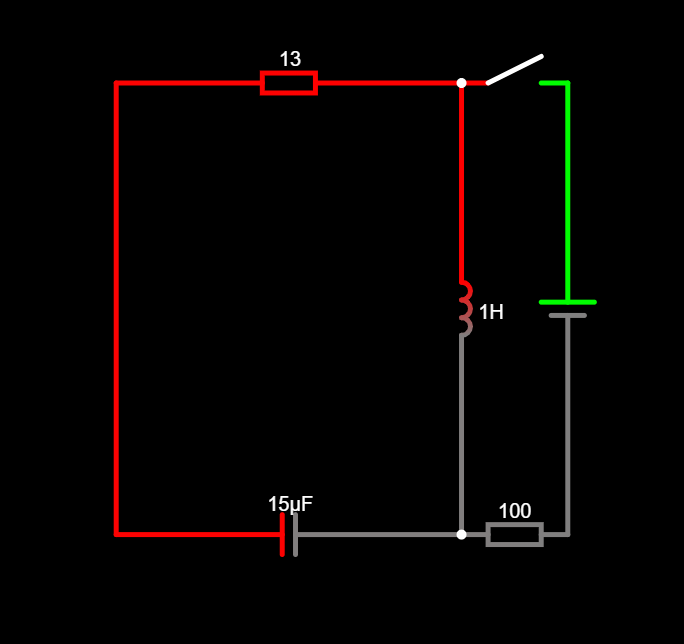

# RLC Circuit Simulation

This project simulates a **simple RLC series circuit** using [CircuitLab](https://www.circuitlab.com/). The goal is to observe and analyze the transient response of an RLC circuit when connected to a DC supply.

## 🔧 Components Used

| Component                  | Value   | Label |
| -------------------------- | ------- | ----- |
| **Resistor (R1)**          | 100 Ω   | R1    |
| **Resistor (R2)**          | 13 Ω    | R2    |
| **Inductor (L1)**          | 10 mH   | L1    |
| **Capacitor (C1)**         | 100 μF  | C1    |
| **DC Voltage Source (V1)** | 10 V DC | V1    |
| **Switch (S1)**            | -       | S1    |

## ⚡ Objective

The main objective of this simulation is to observe the **transient response** of an RLC series circuit when connected to a DC supply. The key behaviors under study include:

* The voltage across the capacitor as it charges.
* The gradual increase in current through the inductor due to inductive reactance.
* The final steady-state condition of the circuit.

## 📝 Procedure

1. **Circuit Design in CircuitLab**:

   * Placed the **DC voltage source**, **resistors (R1, R2)**, **inductor (L1)**, **capacitor (C1)**, and **switch (S1)** in series.
   * Connected the **ground** to the negative terminal of the voltage source to ensure proper simulation.
   * Used the **switch (S1)** to control the application of the voltage.

2. **Component Values**:

   * Resistor (R1): 100 Ω
   * Resistor (R2): 13 Ω
   * Inductor (L1): 10 mH
   * Capacitor (C1): 100 μF
   * Voltage Source (V1): 10 V DC

3. **Simulation Setup**:

   * Ran a **Time Domain (Transient)** simulation.
   * Set **Stop Time** to 0.1 seconds.
   * Configured **Time Step** to automatic or 1 μs for accuracy.

4. **Plotted Data**:

   * Voltage across **capacitor (C1.v)**.
   * Current through **resistor (R1.i)**.

## 🔍 Observations

* **Capacitor Voltage (C1.v)**: The voltage across the capacitor rises exponentially and asymptotically approaches the supply voltage (10V).
* **Inductor Current (R1.i)**: The current through the resistor increases gradually, as the inductor opposes changes in current due to its inductive reactance.
* **Steady-State Condition**: After the transient period, the capacitor becomes fully charged, and the inductor acts as a short circuit (zero resistance).
* **Switch Behavior**: The switch controls when the voltage is applied to the circuit, allowing for easier analysis of the charging process.

The full circuit can be viewed here: [CircuitLab Simulation Link](https://tinyurl.com/ym5atrul)

## 📷 Circuit Diagram

## 📈 Simulation Results

### Voltage across Capacitor (C1.v)

*(Attach a screenshot of the voltage graph showing capacitor charging behavior.)*

### Current through Resistor (R1.i)

*(Attach a screenshot of the current graph showing the gradual build-up of current.)*

## 💡 Concepts Learned

* **Transient behavior of RLC circuits**: Observing the dynamic response of the circuit as it transitions from initial conditions to steady-state.
* **Role of the Capacitor**: Understanding how the capacitor charges over time, ultimately reaching the supply voltage.
* **Inductive Reactance**: The inductor resists changes in current, which leads to a delayed build-up of current through the circuit.
* **Switching Behavior**: Observing how the switch controls the voltage application and influences the transient response.
* **CircuitLab for Simulation**: Familiarity with using CircuitLab as a tool for designing and simulating electronic circuits.

## 🔗 References

* [CircuitLab Online Simulator](https://www.circuitlab.com/)
* [RLC Circuit Theory - Electronics Tutorials](https://www.electronics-tutorials.ws/accircuits/rlc-circuit.html)

---

### ✨ Author

**Your Name**
*Your GitHub Profile or Contact Information*

---
